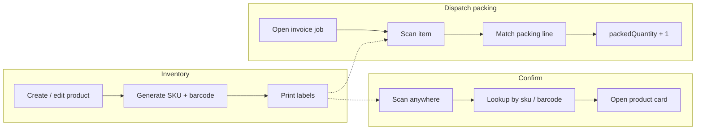

# Barcode Generation and Scanning

## Overview

Elevate already tracks products, warehouse bins, dispatch packing, and installed-machine serials. What it does **not** do yet is identify a physical box by scanning it.

Today a dispatcher packing an invoice types a quantity by hand. A stock counter searches by product name. A product can be edited with a SKU field in the UI, but that SKU is **not stored** on `StockProduct`. Barcodes close that gap: every sellable product gets a code, a printable label, and a scan action that finds or confirms that product instead of typing.

This document is the implementation plan. It is written against the current inventory and dispatch code, not a generic warehouse system.

## What already exists

| Area | Current behaviour | Gap |
|------|-------------------|-----|
| Product identity | Mongo `_id` + name. Optional SKU in the edit dialog is sent on `PUT` but dropped by the schema. | No persisted `sku` or `barcode`. |
| Create product | Name, category, prices, quantity, tax, expiry. | No code generated at create. |
| Dispatch packing | `/admin/stock/dispatch/[invoiceId]` and `/employee/dispatch/[invoiceId]` — `Input type="number"` for `packedQuantity`. | Manual numbers, no scan. |
| Stock check | Counted quantity typed per product, search by name/category. | No scan-to-count. |
| Receiving | `POST /api/stock/add` increments quantity. | No scan-to-receive. |
| Quotations / invoices | Typeahead on product name. | No scan-to-add line. |
| Installed machines | `serialNumber` and `assetTag` already exist. | Serial is captured after install, not at pack. |
| WMS | Bin `code` on `StockLocation`. Canvas “label” is a drawing, not a barcode. | Bin labels are not printable barcodes. |
| Hardware | No scanner, camera, or label print in stock flows. | — |

Stock quantity is **not** reduced at pack or dispatch. It is reduced when the invoice is posted. Scanning at dispatch therefore confirms *which physical units left the shelf*, it does not replace posting.

Services (`productType: "service"`) should not get barcodes.

## Identifiers (do not mix these up)

Elevate needs three different codes. They solve different jobs.

```
SKU          ELV-HEM-0042        Human-readable product code. One per catalog product.
Barcode      (Code 128 of SKU)   Same value, printed so a scanner can read it.
Serial       SN-A2918            Unique per physical machine after sale/install.
Bin code     A-03-12             Warehouse location (already on StockLocation.code).
```

**SKU / barcode** answers: “what product is this?”  
**Serial** answers: “which exact unit is this?” (hematology analyser, centrifuge).  
**Bin code** answers: “where does it live?”

For consumables and reagents, SKU-only is enough. For capital equipment that becomes an `InstalledMachine`, scan the SKU at pack, then optionally capture the serial on the same packing line so engineering inherits it.

If a supplier already printed an EAN-13 / UPC on the box, store that as `manufacturerBarcode` and accept it on scan as an alias. Elevate still owns `sku` so labels can be printed even when the manufacturer code is missing.

## Recommended barcode format

| Choice | Recommendation | Why |
|--------|----------------|-----|
| Symbology | **Code 128** | Alphanumeric, compact, USB scanners and phone cameras both read it well. No GS1 membership required. |
| Encoded value | The SKU string itself | One lookup key. Print what you store. |
| SKU shape | `{ORG}-{CAT}-{NNNN}` e.g. `ELV-HEM-0042` | Readable on a label if the barcode fails. Unique per organisation. |
| Fallback | QR of the same SKU | Optional second symbol on the label for camera-only phones. Same payload. |
| Do not use | Raw Mongo `_id` as the barcode | Ugly on labels, leaks internal ids, hard to read aloud. |

Auto-generate on product create when SKU is blank:

1. Org prefix from company slug (first 3 letters, uppercase).
2. Category prefix from category name (first 3 letters).
3. Next sequence for that org (zero-padded 4 digits).
4. Persist `sku` and set `barcode = sku`.

Staff can override SKU before first print. After labels exist, changing SKU is an explicit “reprint labels” action.

## How it fits the current flows



### 1. Generate a barcode for every product

**Where:** Add Inventory (`/admin/stock/add-inventory`) and the product edit dialog.

On create (physical products only):

- Generate SKU if empty.
- Show the barcode on the product row and on the product detail panel.
- **Print label** opens a browser print sheet: product name, SKU, Code 128, selling price optional, copies = current quantity or a typed count.

On edit:

- SKU field already exists in `product-edit-dialog.tsx`. Wire it to the schema so it actually saves.
- Show a live barcode preview.
- “Print labels” with copy count (for a newly received carton).

Bulk CSV: add `SKU` and `Manufacturer Barcode` columns. Blank SKU → auto-generate during `bulkUploadProducts`.

Existing catalogue: a one-shot **Generate missing barcodes** admin action assigns SKUs to products that have none, then staff print a sheet per warehouse.

**Bulk print from Products:** on Inventory Status → Products, tick several products (or Select all with SKU), set copies each, and **Print barcodes**. Labels tile 3-up on A4 and flow onto extra pages as needed. Row printer icons still print a single product.

### 2. Scan to confirm it is the right product

**Where:** Add Inventory search, WMS product-on-bin, and a small global “Scan” control on stock pages.

A scan is just fast identity:

1. Focus a hidden/visible scan field (USB scanners type + Enter).
2. `GET /api/stock/products/lookup?code=ELV-HEM-0042`
3. If found: highlight the product, show name, on-hand qty, bin, image.
4. If not found: “No product for this code” — do not silently create one.

This is the check before putting a box on a shelf or handing it to a customer. Dispatch uses the same lookup, then increments packed qty instead of only showing the card.

Phone / tablet: camera overlay (`BarcodeDetector` where supported, else a JS decoder). Desktop packing desks: USB or Bluetooth HID scanner — they behave like a keyboard and need no camera permission.

### 3. Scan at dispatch instead of typing quantities

This is the highest-value change. Packing already has `packingItems[{ productId, productName, requiredQuantity, packedQuantity }]`. A scan should drive `packedQuantity`, not replace the job list.

**Happy path**

1. Dispatcher opens `/admin/stock/dispatch/[invoiceId]` or `/employee/dispatch/[invoiceId]`.
2. Scan field is focused the whole time packing is open.
3. Scan `ELV-HEM-0042`.
4. System finds that SKU, matches `productId` on this invoice’s packing list.
5. `packedQuantity` increases by 1 (or by a held “qty multiplier” defaulting to 1).
6. Line turns complete when `packedQuantity >= requiredQuantity`.
7. Existing `PUT /api/stock/invoices/:invoiceId/dispatch/packing` saves as it does today (debounce after each accepted scan).

**Error cases (must be loud)**

| Scan result | UI |
|-------------|----|
| Product not in this invoice | Red toast: “Not on this job”. Do not increment anything. |
| Line already complete | Amber: “Already packed 4/4”. Extra scans ignored unless they confirm an override. |
| Unknown code | Red: “Unknown barcode”. |
| Service line | Ignore; services are not scanned. |
| Wrong warehouse / inactive product | Red with the product name so they can put the box back. |

Manual number input stays as a fallback when a label is damaged.

Optional next step for equipment lines: after the SKU scan, prompt for **serial number** and store it on that packing line, then copy onto the auto-created `InstalledMachine` at invoice post (those machines are created today **without** a serial).

### 4. Other places scanning pays off

Once lookup exists, the same scan control plugs into the rest of stock without new hardware.

| Screen | Scan does |
|--------|-----------|
| **Stock check review** | Find the line and add 1 to `countedQuantity` instead of searching by name. |
| **Add stock / receiving** | Identify the product, then type or scan the received qty. Later: scan each unit. |
| **Quotations** | Add a line (qty 1, increment if scanned again) instead of typeahead. |
| **Walk-in invoice** | Same as quotations. |
| **WMS** | Scan product, then scan bin code to attach `StockProductLocation`. |
| **Credit notes / returns** | Confirm the returned box matches the credited line. |
| **Installed machines / engineer** | Scan a QR on the machine plate that encodes `serialNumber` (already a field). Different from product SKU. |
| **Bin labels** | Print Code 128 of `StockLocation.code` so put-away is scan product → scan bin. |

Do not start with all of these. Dispatch packing + product labels + lookup is the core. Stock check is the natural second screen because it is also “scan instead of typing a number”.

## Data model

### `StockProduct` additions

```ts
sku: string                 // unique per org, indexed
barcode: string             // usually === sku; Code 128 payload
manufacturerBarcode?: string // supplier EAN/UPC if present
barcodeSymbology: "code128" | "ean13" | "qr"
labelsPrintedAt?: Date
labelsPrintedCount?: number
```

Indexes:

- `{ org_id: 1, sku: 1 }` unique, sparse
- `{ org_id: 1, barcode: 1 }` unique, sparse
- `{ org_id: 1, manufacturerBarcode: 1 }` sparse

Lookup tries `sku`, then `barcode`, then `manufacturerBarcode`. All comparisons are trimmed, case-insensitive for SKU.

### Dispatch packing line (optional, phase 2)

```ts
packingItems: [{
  productId, productName, requiredQuantity, packedQuantity,
  scannedAt?: Date,
  serials?: string[]   // captured units for equipment
}]
```

Phase 1 can ship **without** schema changes on packing: increment `packedQuantity` only.

### Lookup audit (optional)

A light `BarcodeScan` log (`org_id`, `userId`, `code`, `productId`, `context: dispatch|stock-check|confirm|receive`, `invoiceId?`, `ok`, `reason`) is useful when a customer claims a wrong item left. Not required for MVP.

## API

All routes stay under `/api/stock`, same auth and `org_id` scoping as the rest of inventory.

| Method | Path | Purpose |
|--------|------|---------|
| `POST` | `/api/stock/products/:id/barcode` | Generate SKU/barcode if missing; return SVG/PNG payload. |
| `POST` | `/api/stock/products/barcodes/generate-missing` | Admin: backfill SKUs. |
| `GET` | `/api/stock/products/lookup?code=` | Resolve sku / barcode / manufacturer code → product. |
| `GET` | `/api/stock/products/:id/label?copies=` | HTML or PDF print sheet. |
| `PUT` | `/api/stock/invoices/:invoiceId/dispatch/packing` | **Existing.** Scan UI calls this after each accepted scan. |
| `POST` | `/api/stock/invoices/:invoiceId/dispatch/scan` | Optional convenience: `{ code, increment?: number }` → match line, increment, persist packing, return updated items. |

`createProduct` / `updateProduct` must persist `sku` and `barcode`. That also fixes the current edit-dialog SKU that is sent and ignored.

CSV bulk upload accepts `SKU` / `Manufacturer Barcode`.

## Frontend

### Shared `BarcodeScanField`

One component, used on dispatch, stock check, inventory, quotations:

- Always-on text input (USB/HID scanners).
- Optional “Use camera” button (phones, `lg` hidden or secondary).
- Debounce is **not** for HID: scanners send a burst + Enter. Handle `onKeyDown` Enter.
- Ignore scans shorter than 3 characters to avoid catching normal typing in other fields.
- When camera is open, pause HID so you do not double-count.

Libraries (all client-side, no new backend vendor):

- **Generate / print:** `jsbarcode` (Code 128 SVG) + existing print CSS, or `bwip-js`.
- **Camera decode:** `BarcodeDetector` API first; fallback `@zxing/browser`.
- Do not require a native app. Dispatch already runs in the browser on admin and employee portals.

### Product UI

- SKU column on the inventory table (search already pretends to filter `product.sku`).
- Barcode thumbnail + Print on the row actions.
- Create form: SKU optional, placeholder “Auto-generated on save”.

### Dispatch packing UI

Replace the packing card header with a large scan target:

```
Scan items for INV-1042          [||||||||||||||]  camera
Hematology reagent  3/4  last scan 2s ago
```

Keep the per-line number inputs. Completing a line still uses the existing checkbox (read-only complete state). Save button remains for people who typed quantities without scanning.

## Hardware

| Device | How it talks to Elevate | Best place |
|--------|-------------------------|------------|
| USB barcode scanner | Keyboard wedge, no driver | Dispatch desk, receiving |
| Bluetooth scanner | Same, pairs as HID keyboard | Warehouse phone/tablet |
| Phone / tablet camera | In-browser decoder | Field confirm, stock check |
| Office printer | Browser print of label sheets (A4 stickers) | First labels |
| Thermal label printer (Zebra etc.) | Phase 3: ZPL from `sku` + name | High volume |

USB scanners work on the current desktop dispatch page with almost no UX change if the scan field stays focused. That is why packing is the first workflow.

## What we will not do in v1

- GS1 / GTIN company prefix (not needed until retail POS).
- Lot/batch as a second barcode (product-level expiry exists; per-bin lots are a separate project).
- Deducting stock on scan (would fight invoice posting).
- Native iOS/Android app.
- Encoding Mongo ids.
- Barcodes on service products.

## Rollout

### Phase 1 — Catalogue + confirm + dispatch scan

1. Persist `sku` / `barcode` / `manufacturerBarcode` on `StockProduct`.
2. Auto-generate on create; backfill existing products.
3. Print labels from inventory.
4. Lookup API + scan field on inventory (confirm).
5. Scan field on dispatch packing: increment `packedQuantity` via existing or new scan endpoint.
6. Keep manual qty as fallback.

**Done when:** a dispatcher can pack an invoice without typing a number, and a wrong product beep-fails.

### Phase 2 — Count and receive

- Stock-check review: scan increments `countedQuantity`.
- Add-stock: scan identifies the product.
- Quotations: scan adds a line.

### Phase 3 — Units and locations

- Serial capture on packing for equipment → `InstalledMachine.serialNumber`.
- Bin label print + scan product then bin.
- Thermal printer / ZPL if volume justifies it.
- Scan audit log.

## Roles

Same as current stock:

- **company_admin / admin / hr:** generate, backfill, print, all scans.
- **dispatch:** scan on assigned jobs; print if they also have inventory access (they already see Add Inventory, WMS, stock check, dispatch).
- **employee** on `/employee/dispatch/...`: scan packing on assigned invoices only (`canManageDispatchForInvoice` unchanged).
- **sales_rep:** scan on quotations only in phase 2.

## Security and tenancy

- Lookup is org-scoped. A code from another tenant must not resolve.
- SKU unique per `org_id`, not globally.
- Scan-to-pack must still pass `canManageDispatchForInvoice` (assigned user or admin role).
- Do not put prices or customer data in the barcode payload — SKU only.

## Files to change (when building)

| Layer | Files |
|-------|--------|
| Schema | `server/src/models/StockProduct.ts` |
| Create/update/CSV | `server/src/controllers/stockController.ts` (`createProduct`, `updateProduct`, `bulkUploadProducts`) |
| Lookup / labels | new handlers on `server/src/routes/stock.routes.ts` |
| Dispatch scan | `stockController.ts` packing helpers + optional `dispatch/scan` |
| Inventory UI | `components/admin/stock/stock-manager-content.tsx`, `product-edit-dialog.tsx` |
| Packing UI | `components/stock/dispatch-workflow.tsx` |
| Shared scan | new `components/stock/barcode-scan-field.tsx` |
| Print | new label sheet page or print CSS component |
| CSV template | `public/static/sample-products.csv` |

The product edit dialog already posts `sku`. Phase 1 starts by honouring that field.

## Success criteria

- Every active physical product has a unique SKU and a printable Code 128.
- Scanning that code on Add Inventory opens the same product.
- Scanning it on an assigned dispatch job adds 1 to the correct packing line and rejects items that are not on the invoice.
- Damaged-label fallback: typing the SKU or the quantity still works.
- Phone camera and USB scanner both work on the same field.
- Service products never get a barcode.

## Open choices (decide at build time)

1. **SKU prefix** — company slug vs a fixed `ELV` vs per-branch prefix.
2. **Default copies when printing** — 1 vs `currentQuantity`.
3. **Beep** — browser `Audio` on good/bad scan at the dispatch desk (recommended).
4. **Over-scan** — hard block vs supervisor override when packed > required.
5. **Manufacturer barcodes** — accept from day one (cheap) or SKU-only until suppliers demand it.

Recommendation: unique per-org SKU, print 1 copy by default with a copies field, beep on desk scanners, hard block over-scan, accept manufacturer barcodes on lookup from day one.
